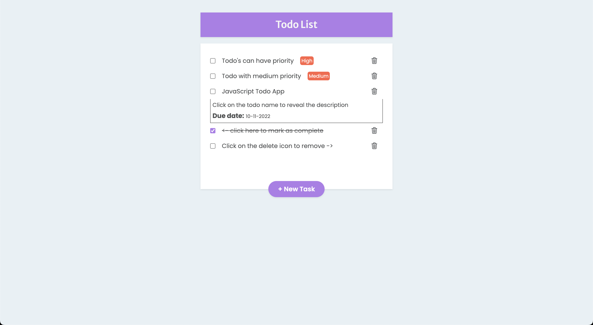
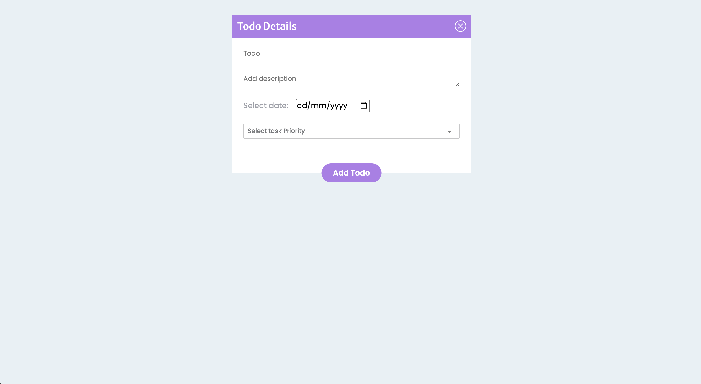
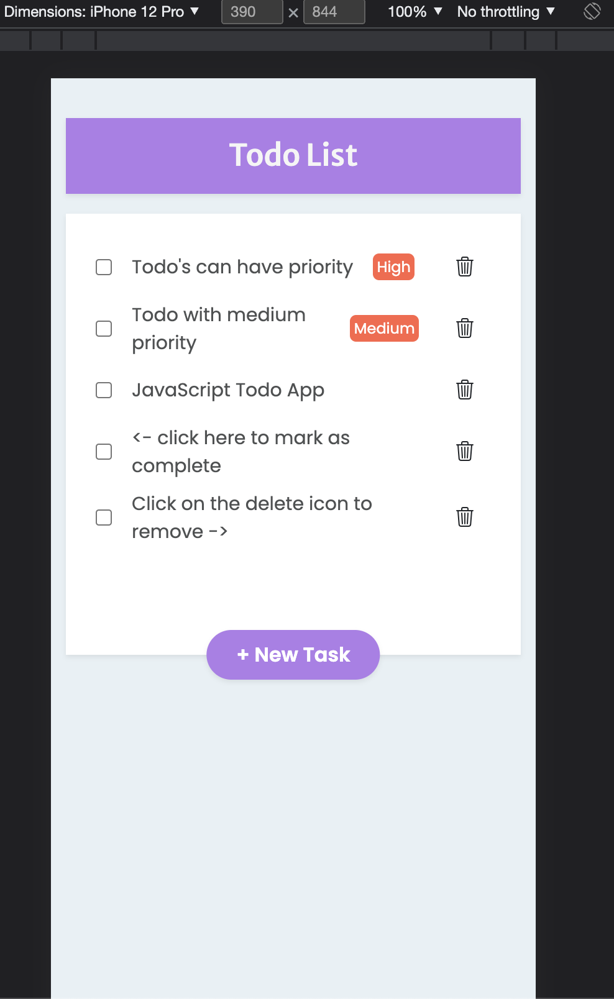

# JavaScript Todo App

 &nbsp;
 &nbsp;
 &nbsp; 
 &nbsp;

A JavaScript todo application with browser local storage support.

Design Inspiration: [Image link](/todoDesign.png)

### Features 
- Add, remove, mark as complete
- Add priority to a todo (High, Medium, Low)
- Add due date and description for a todo
- Todo with higher priority display at the top
- Todo's are stored in browser local storage
- Mobile responsive

ScreenShots

Desktop

Mobile

